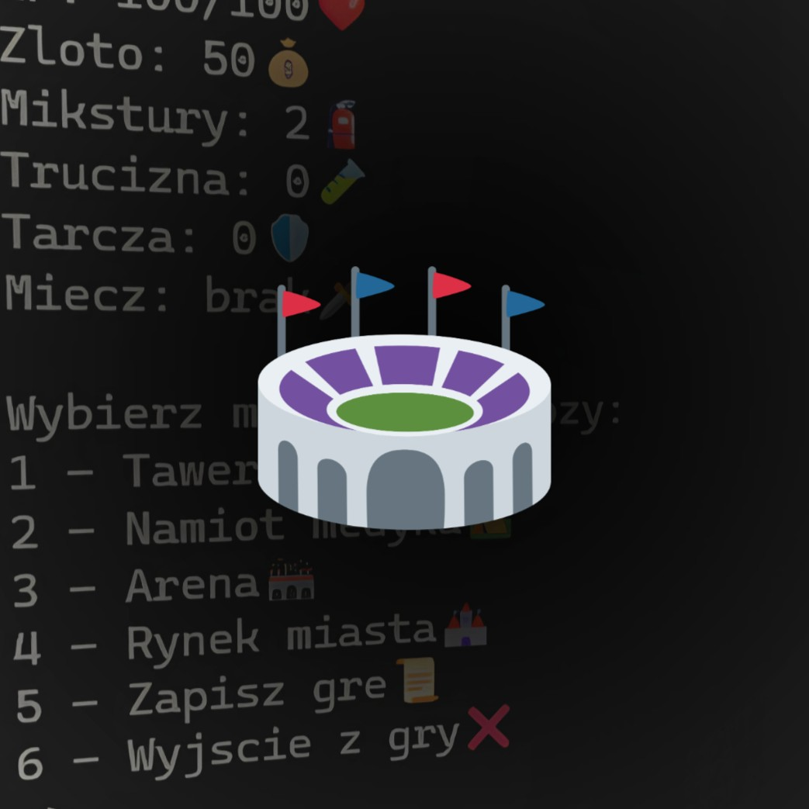
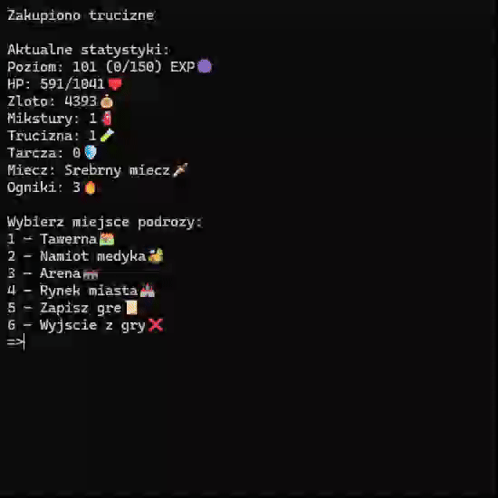
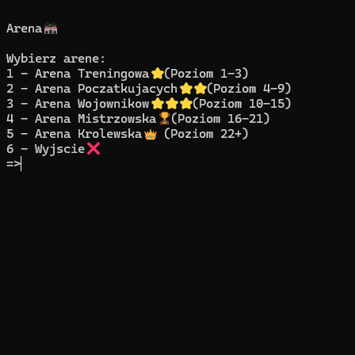
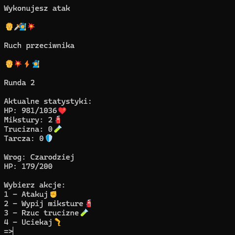
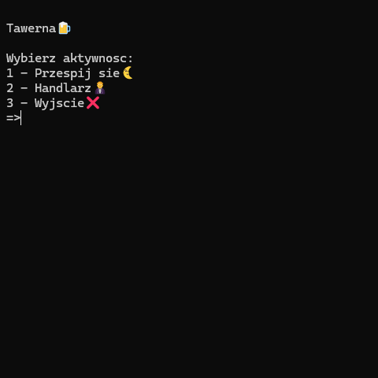
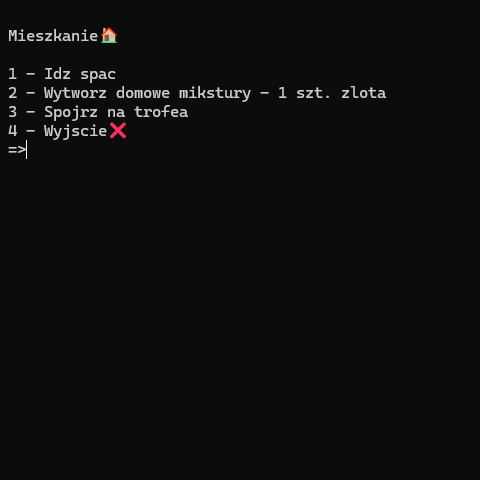
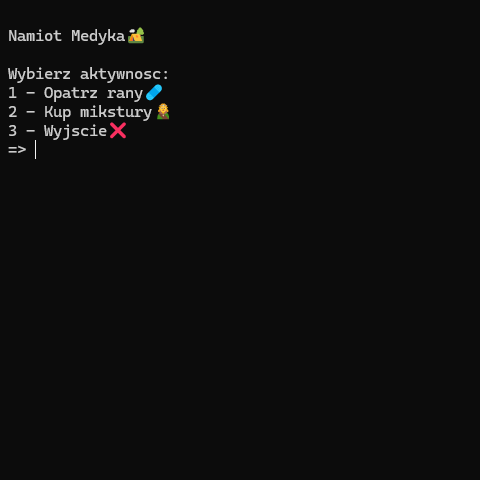
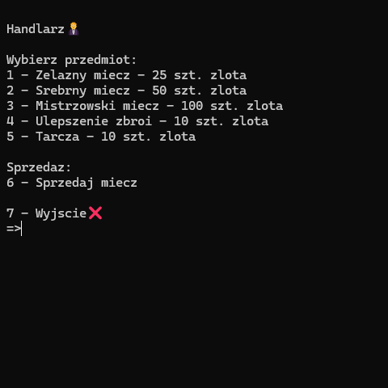
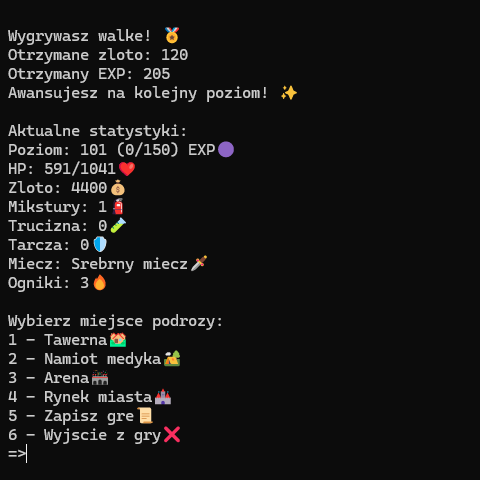
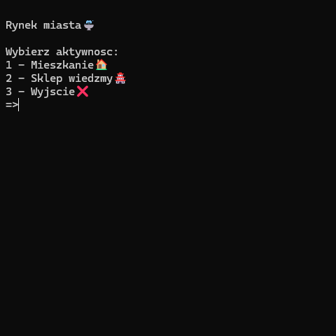

# Arena - Turn-Based RPG Game

  

## Table of Contents
- 🚀 [Project Overview](#project-overview)
- ✨ [Features](#features)
- 💻 [Technologies](#technologies)
- 📋 [Requirements](#requirements)
- 🛠️ [Setup Instructions](#setup-instructions)
- 🪙 [All Purchasable Items Info Polish](#all-purchasable-items-info-polish)
- 📸 [Screenshots](#screenshots)

## Project Overview
**Arena** is a text-based RPG where the player takes on the role of a warrior fighting in various arenas against diverse opponents, battling for the title of "Challenger". Developed in Python, the game is played entirely in the command line. (This is my first 'bigger' project, and some of the coding solutions might be, let's say, less than optimal :P) 

> [!NOTE]  
> **The game is only available in Polish language version!**

## Features

- 📈 Systems for gaining experience, gold, and trophies
- 🛒 Shops enabling armor upgrades, purchasing weapons, potions, poisons, bandages
- 🏠 The option to purchase a house that enables cheaper brewing of healing potions and free health regeneration after battle
- 🏟️ 5 arenas unlocked during gameplay, each with unique opponents and varying difficulty levels
- 💾 Ability to save your game progress

## Technologies

- Python 3.10

## Requirements
Any system capable of running .exe files in a command line environment that supports emoji display.

## Setup Instructions

1. Extract the `Arena.zip` file.
2. Run the `Arena.exe` file to start the game.

## All Purchasable Items Info Polish

| **Nazwa📖**               | **Cena🪙** | **Cecha⬆️**                          | **Szczegółyℹ️**                          |
|:-----------------------:|:--------:|:----------------------------------:|:--------------------------------------:|
| Przespij się            | 5-12     | +5-90 HP                          |                  Losowe działanie                      |
| Żelazny miecz          | 25       | +2 DMG                            |                   -                     |
| Srebrny miecz          | 50       | +5 DMG                            |                   -                    |
| Mistrzowski miecz      | 100      | +11 DMG                           |                   -                     |
| Magiczny miecz         | 199      | +23 DMG                          | Odblokowywany na 5 poziomie postaci    |
| Starożytny miecz       | 320      | +36 DMG                           | Odblokowywany na 5 poziomie postaci    |
| Boski miecz            | 480      | +50 DMG                           | Odblokowywany na 5 poziomie postaci    |
| Ulepszenie zbroi       | 10       | +4 max HP                         | Maks. 10 razy (+40 max HP)             |
| Tarcza                 | 10       | 100% negacja obrażeń przeciwnika             | Działa na 1 rundę                      |
| Podstawowy opatrunek   | 5        | +20 HP                            |                 -                       |
| Zatrzymanie krwawienia | 10       | +45 HP                            |                 -                       |
| Usztywnienie złamania  | 20       | +90 HP                            |                 -                       |
| Mikstura podstawowa    | 5/1*     | +15 HP                            | *W mieszkaniu                     |
| Trucizna               | 7        | +3 poison DMG                     | Do końca walki                         |
| Mieszkanie             | 500      | Darmowy odpoczynek, tańsze mikstury | Odblokowywane na 5 poziomie postaci          |
| Ognik                  | 30       | +2 magic DMG                      | Wielokrotny zakup (od 5 poziomu)           |
| Jaszczur               | 260      | +20 magic DMG                     | Jednokrotny zakup (od 5 poziomu)           |

## Screenshots

   

 
 
 
 
